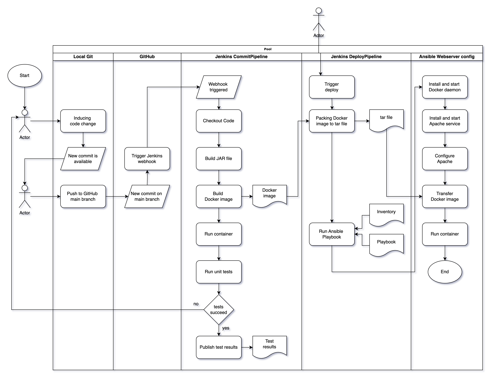

## Was ist die Aufgabe des Projekts
Die Spring Boot App zielt darauf ab, die Effizienz der Jobsuche zu verbessern. Sie sammelt regelmäßig Stellenangebote nach
festgelegten Suchbegriffen und organisiert deren Inhalte in einer Datenbank. Mithilfe einer simplen Weboberfläche können spezifische
Stellenangebote in einer erweiterten Suchfunktion identifiziert werden. (Verlinkung zu Bild)

## UML

  
  
  
  

## Verwendete Technologien 

**Web-Code** 
Java Spring Boot

**Build** 
Maven

**Container** 
Docker

**Automatisierungsserver** 
Jenkins

**Konfiguration** 
Ansible

**Server / Webserver** 
Ubuntu, Apache

# Erweiterungsmöglichkeiten
Im Folgenden werden Möglichkeiten zur Erweiterung der Software aufgezeigt

