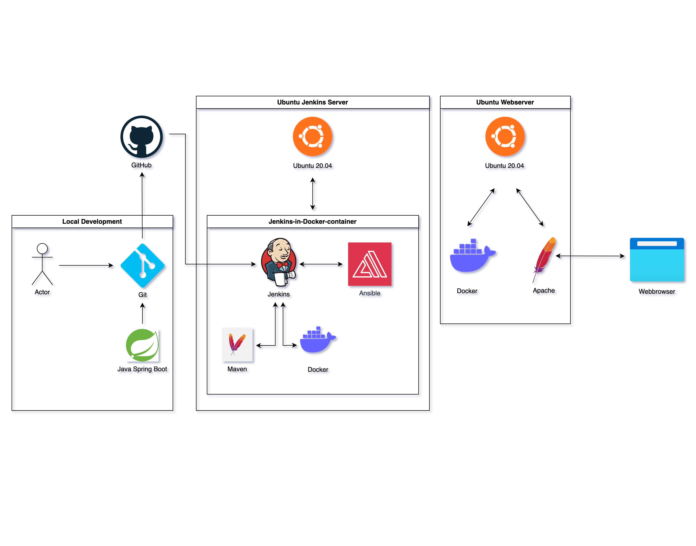

## Was ist die Aufgabe des Projekts
Die Spring Boot App zielt darauf ab, die Effizienz der Jobsuche zu verbessern. Sie sammelt regelmäßig Stellenangebote nach
festgelegten Suchbegriffen und organisiert deren Inhalte in einer Datenbank. Mithilfe einer simplen Weboberfläche können spezifische
Stellenangebote in einer erweiterten Suchfunktion identifiziert werden. (Verlinkung zu Bild)

## UML

  <a href="diagrams/CI-CD-Flowchart.png">
    
     <em>CI-CD Flowchart</em>
  </a>
  <a href="diagrams/System-architecture.png">
    
     <em>System architecture</em>
  </a>
  

## Verwendete Technologien 

**Web-Code** 
Java Spring Boot

**Build** 
Maven

**Container** 
Docker

**Automatisierungsserver** 
Jenkins (siehe <a href="https://github.com/lb-bewerbung/jobscraper-jenkins">Jobscraper-Jenkins</a>)

**Konfigurationsmanagement** 
Ansible (siehe <a href="https://github.com/lb-bewerbung/jobscraper-ansible">Jobscraper-Ansible</a>)

**Server / Webserver** 
Ubuntu, Apache

## Erweiterungsmöglichkeiten
Es werden nachfolgend einige Optionen dargestellt, wie die Applikation und die CI-CD-Prozesse in zukünftigen Iterationen erweitert werden können.

